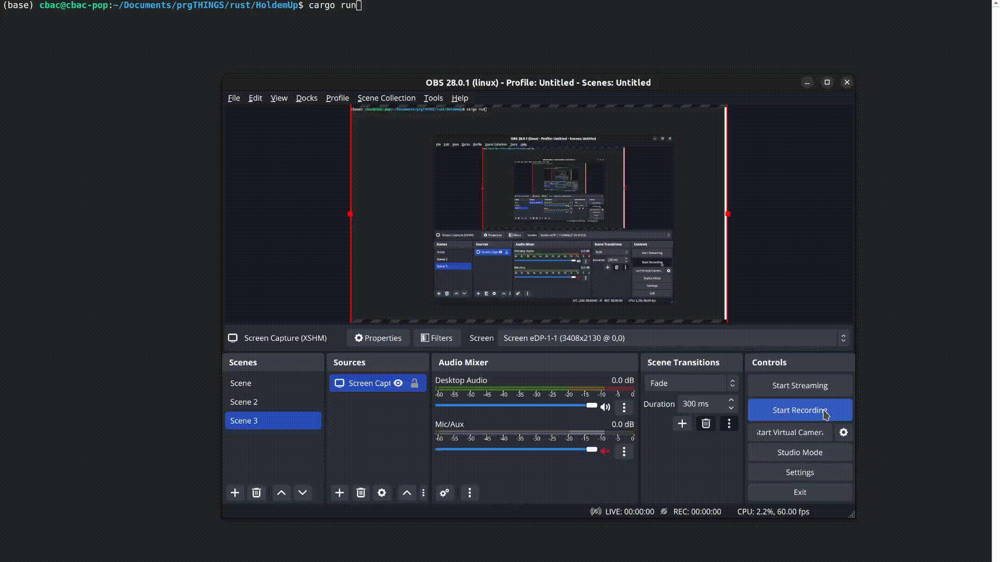

# What it does
The user can input the amount of cards to be drawn on the board
and their associated chances with getting a hand with those cards.

# Example

# How does it work?
There are multiple ways to do something like this. Some methods involve calculating
the outs required for a hand and plugging into a math equation the given inputs.

The main description of the algorithm can be found in src/calculate_odds.md
